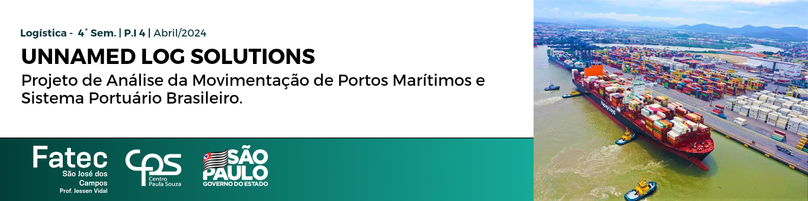

Acompanhamento do processo de aprendizagem por projeto integrador analisando a movimentação de carga nos portos brasileiros. Trabalho pertencente a matéria de Projeto Integrador do 4° Semestre de Logística/2024 pela FATEC SJC.

 

     <a href="#empresa">Empresa</a> • 
     <a href="#projeto">Projeto</a> •
     <a href="#entregas">Entregas</a> •
     <a href="#equipe">Equipe</a> 
  

 
# Unnamed Log Solutions
### Leading the way in logistics excellence. Every mile, every time. 

### Nossa Missão
Facilitar o comércio global e promover o crescimento econômico sustentável através da entrega confiável de soluções logísticas inovadoras para portos e navios, impulsionadas pela excelência operacional e pela tecnologia de ponta.

### Nossa Visão
Ser reconhecido como o parceiro de escolha na indústria marítima, oferecendo soluções logísticas integradas que otimizam a eficiência, a segurança e a sustentabilidade dos portos e navios em todo o mundo.

### Nossos Valores
**Excelência:** Comprometemo-nos com os mais altos padrões de qualidade, desempenho e serviço em tudo o que fazemos.

**Inovação:** Abraçamos a mudança e buscamos constantemente novas ideias e tecnologias para melhorar nossos serviços e impulsionar o progresso da indústria.

**Integridade:** Agimos com honestidade, transparência e ética em todas as nossas interações, construindo relacionamentos baseados na confiança e na credibilidade.

**Sustentabilidade:** Promovemos práticas ambientalmente responsáveis e buscamos soluções que equilibrem as necessidades econômicas, sociais e ambientais.

**Colaboração:** Valorizamos a diversidade de pensamento e trabalhamos em estreita colaboração com nossos clientes, parceiros e comunidades para alcançar objetivos comuns.

Esses elementos formam a espinha dorsal da nossa empresa, orientando-nos em direção ao sucesso enquanto contribuímos para um mundo mais conectado, eficiente e sustentável.

# :mag_right: Sobre o projeto:

O objetivo deste projeto é desenvolver uma série histórica acessível que consolide os dados de movimentação dos portos, oferecendo uma plataforma abrangente para análise. Além disso, será elaborado um modelo de projeção utilizando técnicas de regressão, visando explicar a variação da prancha média operacional ao longo do tempo. O foco será demonstrar profundo conhecimento sobre modelos de eficiência para análise, interpretando os dados dentro do contexto de big data. A capacidade de modelar grandes volumes de dados será essencial para esse propósito, assim como a habilidade de criar modelos de projeção que ofereçam insights precisos e úteis. Adicionalmente, será necessário compreender as características técnicas da estrutura portuária para garantir que os modelos desenvolvidos sejam aplicáveis e relevantes para o ambiente em questão.

 

 
### :bar_chart: Composição do projeto

  - Banco de Dados Técnicos, fornecidos pelo cliente interno.
  - Trabalho de acompanhamento e conclusão de projeto, extraídos via pesquisa de campo e referências bibliográficas.
  - Código Base para tratamento de dados, via Python.
  -  Dashboard Interativo para visualização e análise dos dados, via Power BI.
  -  Repositório do projeto, via Github

 ### :hammer_and_wrench: Ferramentas e Tecnologias

* Python
* GitHub
* PowerBI 
* Jira Software
* Slack 
* Microsoft Office

 
  
## Etapas do projeto 

### :dart: Entregas

Sprint ID | Data | Tag | Status
----------|-----|-----|-------
#1 | 16/04/2024 | 
<a >1ª Sprint</a>
 | CONCLUÍDO
#2 | 07/05/2024 | 
<a >2ª Sprint</a>
 | CONCLUÍDO
#3 | 28/05/2024 | 
<a >3ª Sprint</a>
 | CONCLUÍDO
#4 | 18/06/2024 | 
<a >4ª Sprint</a>
 | CONCLUÍDO

**Sprint 1:**
>     Presentation 16/04/2024
* Backlog do produto​
* GitHub estruturado com link disponibilizado​
* Jira Software estruturado​
* Atribuição das atividades para a Sprint 2 

**Sprint 2:**
>    Presentation 07/05/2024
* Criação da Parte do Código para Seleção dos Dados de Atracação
* Criação da Parte do Código para Seleção dos Dados de Carga
* Concatenação dos Dados em Python
* Documentação do Código até o Fim da Sprint 2
* Atribuição da Sprint 3

**Sprint 3:**
>    Presentation 28/05/2024
* A definir pelo cliente...

**Sprint 4:**
>    Presentation 18/06/2024
* Conclusão do Projeto.
* Apresentação e Execução do Produto completo.
* Documentação de Acompanhamento e Conclusão do Projeto. 

 

 # :busts_in_silhouette: Equipe:
 Scrum Master | Product Owner | Dev | Dev | Dev |
 -------------|---------------|-----|-----|-----|
 [ Ana Carolina Ramos ](https://github.com/magamissy)  | [ Vanderson Costa ](https://github.com/Eusou1337)  | [ Lucas Nobre ]()  | [ Matheus Roque ](https://github.com/matheussjc)  | [ Cauã Patrick ]() 

 
# Agradecimentos
* Centro Paula Souza
* FATEC - Faculdade de Tecnologia de São José dos Campos Prof. Jessen Vidal
* Professores do corpo docente da turma de Logística/2024, Noturno
* Turma do 4° Semestre / Inicio em Agosto de 2022

**Obrigado por nos visitar, good coding!**

**Thanks to visiting us and good coding!**
